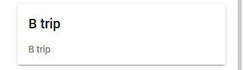

# Projet_TravelLog

## Introduction
Dans le cadre de notre formation à la HEIG-VD, nous avons réalisé une application mobile. L’application en question est une application de voyage. Un utilisateur peut ajouter les voyages qu’il a effectué ainsi que les places qu’il a visité. Le but d’un tel projet est de mettre en pratique les divers éléments vu lors des cours de Mathias Oberson. 

Nous avons repris l’API proposé par Mathias. Nous avons fait ce choix, car celle que nous avons développée, lors du précédent cours, comportait beaucoup trop d’erreurs et modifications à apporter. Comme le temps nous est compté, nous avons préféré partir sur une API valide.

## Login
Pour pouvoir utiliser notre application, un compte utilisateur est nécessaire. C'est pourquoi, la première page de notre application est une page de login.

## Page Home
Une fois le login effectué, l’utilisateur se retrouve sur la page d’accueil de l’application qui s'affiche comme ceci :

### Logout
Si l’utilisateur souhaite se déconnecter de l’application, il peut le faire, à tout moment, en cliquant sur l’icône présente sur le haut de l’application : 

### Menu
Le menu de l’application est visible sur le bas de l’écran. Il comporte 5 éléments :
1. **Account :** permet de se rendre sur la page “Account”
2. **Trips :** permet de se rendre sur la page qui liste tous les voyages
3. **Places :** permet de se rendre sur la page qui liste toutes les places
4. **Map :** permet de se rendre sur la page qui indique sur une carte la position actuelle de l'utilisateur ainsi que toutes les places
5. **Stats :** permet de se rendre sur la page qui indique les statistiques de l’application en temps réel

## Page “Account”
La page “Account” se présente comme ceci :

Sur cette page, l'utilisateur a la possibilité de modifier son nom d'utilisateur et/ou son mot de passe. Pour valider les changements effectués, il suffit de cliquer sur le bouton “UPDATE ACCOUNT” (à noter que cette fonctionnalité n'est pas implémentée).

Il a également la possibilité de voir tous ses propres voyages qu’il a enregistré. Pour se faire, il doit cliquer sur le bouton “MY TRIPS”.

Le dernier bouton présent sur la page “MY GALLERY” permet à l'utilisateur de prendre des photos, depuis son smartphone, et/ou de voir les photos précédemment prises.

### My Trips
La page “My Trips” se présente comme ceci :

Sur le haut de l’application, un filtre est mis à disposition de l’utilisateur, pour qu’il puisse filtrer les résultats affichés.

Juste en dessous, une courte phrase indique le nombre de résultats affichés.

Chaque résultat apparaît dans un rectangle. On retrouve le nom du voyage, la description et deux boutons. Le premier permet de supprimer le voyage en question. Le second permet de mettre à jour les informations concernant le voyage sélectionné.

Si l'utilisateur clique sur un voyage, il est redirigé sur la page qui liste toutes les places reliées au voyage sélectionné.

Si l'utilisateur clique sur le bouton jaune-orange, il est redirigé sur la page qui permet de modifier le voyage. Cette page se présente de cette manière :

Il peut alors modifier les informations grâce au formulaire à disposition. En cliquant sur le bouton "CANCEL", il revient à la page précédente. S'il clique sur le bouton "UPDATE", les données entrées sont enregistrées dans l'API à la place des données initiales.

Au bas de la page "My Trips", deux boutons sont présents :

Le bouton “BACK TO ACCOUNT PAGE” permet de retourner à la page précédente. Le bouton “CREATE A TRIP” permet à l’utilisateur de créer un voyage. 

#### Create de Trip
La page “Create Trip” se présente comme ceci :

Pour enregistrer un nouveau voyage, il suffit de remplir le formulaire. Le premier champ correspond au titre du voyage, le second à sa description. 

Le bouton “CANCEL” permet de retourner à la page précédente (à savoir “My Trips”).

Le bouton “CREATE” permet d’enregistrer les données et ainsi, créer le voyage. Si la requête est validée, l’utilisateur est redirigé sur la page “All Trips”.

### My Gallery
En cliquant sur le bouton “My Gallery”, l’utilisateur est dirigé sur une page qui regroupe toutes les photos prises ainsi que la possibilité d’en prendre des nouvelles.

En cliquant sur le bouton plus avec l’icône de l’appareil photo, l’utilisateur peut prendre une photo à l’aide de son smartphone. 

Il est possible que l’utilisateur doive autoriser l’application à prendre des photos et accéder à celles-ci.

Après avoir accepté ces différentes autorisations, l’utilisateur peut prendre la photo qu’il souhaite.

Dès que la photo est prise, l’utilisateur peut valider le clicher ou le refuser pour en reprendre un autre.

Dès que la photo est validée, l’utilisateur est redirigé sur la page d’accueil de la galerie. C’est à cet endroit qu’il peut voir toutes les photos qu’il a.

## Page “Trips”
La page “All Trips” se présente comme ceci :

Sur le haut de l’application, un filtre est mis à disposition de l’utilisateur, pour qu’il puisse filtrer les résultats affichés.

Juste en dessous, une courte phrase indique le nombre de résultats affichés.

Chaque résultat apparaît dans un rectangle. On retrouve le nom du voyage et sa description.

## Page “Places”
La page “All Places” se présente comme ceci :

Sur le haut de l’application, un filtre est mis à disposition de l’utilisateur, pour qu’il puisse filtrer les résultats affichés.

Juste en dessous, une courte phrase indique le nombre de résultats affichés.

Chaque résultat apparaît dans un rectangle. On retrouve le nom de la place et la description.

## Page “Map”
La page “Maps” se présente comme ceci :

Sur cette carte, l’utilisateur peut voir sa position actuelle ainsi que toutes les places enregistrées dans l'API.  

## Page “Stats”

Sur la page de statistiques, l'utilisateur peut voir le nombre de voyages et le nombre de places actuellement enregistrés sur l'API.

